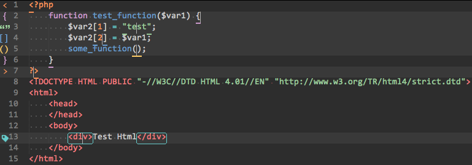
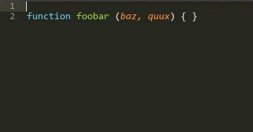

## 简介

vue作为单页面应用已经无可挑剔，这份文档主要是记录那些年我们一起踩过的坑还有我们的项目规范，以及让新同事快速上手。

预祝vue愉快
<p class="tip"> <!-- tip warning danger -->
  对新手和专家都很实用！
</p>

## 安装

```bash
# 全局安装 vue-cli
$ npm install --global vue-cli
# 创建一个基于 webpack 模板的新项目
$ vue init webpack my-project
# 安装依赖，走你
$ cd my-project
$ npm install
$ npm run dev
```
<p class="warning">
    安装vue-cli之前需要nodejs环境，版本v6+、安装git，npm设置淘宝镜像，使用nrm命令快速设置淘宝镜像， `npm install nrm -g` and `nrm use taobao` 就设置好了。
</p>

## 快速入门

项目基于vue-cli创建，可以作为单页面使用

1. 从gitlab上克隆项目`git clone git@gitlab.bl.com:zhangyiqing/04_CloudMerchant_Vue.git`，进入文件目录，执行`npm install`安装依赖
2. 执行`npm run dev`进入开发模式，执行`gulp`进入自动编译scss模式
3. 执行`npm run build`编译代码，编译后的代码会输出到/dist目录下

执行`npm run dev`会自动打开 http://localhost:8088 就能看到你的网站了。

## 目录说明

    ├── README.md                   项目说明文件
    ├── build                       基础配置
    │   ├── build.js                `npm run build` 的实际执行文件
    │   ├── check-versions.js       检查node版本文件
    │   ├── dev-client.js           热更新文件
    │   ├── dev-server.js           `npm run dev`的实际执行文件
    │   ├── utils.js                工具js, 存放通用的工具代码
    │   ├── vue-loader.conf.js      对vue里的css执行编译
    │   ├── webpack.base.conf.js    webpack基础配置
    │   ├── webpack.dev.conf.js     webpack开发环境配置
    │   ├── webpack.prod.conf.js    webpack线上环境配置
    │   └── webpack.test.conf.js    webpack测试环境配置
    ├── config  配置目录
    │   ├── dev.env.js              开发环境配置
    │   ├── index.js                配置公共接口
    │   ├── prod.env.js             线上环境配置
    │   └── test.env.js             测试环境配置
    ├── dist                        项目打包地址,打包后的代码会存放在该目录内
    ├── gulpfile.js                 gulp配置文件，配置了自动编译sass
    ├── index.html                  入口html文件
    ├── mock                        mock数据存放目录
    ├── package.json                依赖包文件
    ├── src                         项目目录，所有相关文件都在在里
    │   ├── App.vue                 入口vue文件
    │   ├── api                     ajax请求目录
    │   ├── assets                  存放图片资源目录，图片小于5k会自动转成base64打包在js文件中
    │   ├── components              公用组件 当项目中有公用组件时, 可以存放在该目录下
    │   │   ├── cloud-merchant      项目组件，当项目中有私有组件，可以存放在这个目录下
    │   │   ├── components.vue      组件演示文件
    │   │   ├── index.js            组件在这个文件中对外暴露出的公共接口
    │   ├── direction               指令目录
    │   ├── main.js                 入口js
    │   ├── mixins                  mixins目录
    │   ├── router                  路由目录
    │   │   └── index.js
    │   ├── sass                    sass目录
    │   │   ├── _icons.scss         存放图标样式
    │   │   ├── base64              存放要转成base64的图片目录
    │   │   ├── comm.scss           存放公共样式
    │   │   ├── gift-coupon.scss    页面样式
    │   │   └── tobe                存放sass方法目录
    │   ├── store                   存放数据目录
    │   │   ├── actions.js          在这个文件中写异步操作代码
    │   │   ├── getters.js          在这个文件中写对数据过滤清洗等操作，并且导出数据给view层
    │   │   ├── index.js            注册store文件
    │   │   ├── modules             modules数据
    │   │   └── mutation-types.js   事件类型
    │   ├── utils.js                工具类
    │   └── views                   视图目录
    │       └── vuexdemo.vue
    ├── static                      静态资源，所有静态相关文件都在这里
    │   └── css                     静态资源-样式
    │       ├── comm.css
    │       └── gift-coupon.css
    ├── test                        测试目录
    │   └── unit
    │       ├── index.js
    │       ├── karma.conf.js
    │       └── specs
    └── yarn.lock

## 项目规范

### Eslint

- 使用主流的 `standard` 作为js标准，使用eslint进行代码校验，其目的是使团队每个人书写的代码风格一致，并且输出高质量的代码。规则在项目根目录下的`.eslintrc.js`文件中

```js
module.exports = {
  root: true,
  parser: 'babel-eslint',
  parserOptions: {
    sourceType: 'module'
  },
  env: {
    browser: true,
  },
  // https://github.com/feross/standard/blob/master/RULES.md#javascript-standard-style  规则
  extends: 'standard',
  plugins: [
    'html'
  ],
  // 可以再rules中继续添加规则，0 - 关闭，1 - 警告，2 - 错误
  'rules': {
    // allow paren-less arrow functions
    'arrow-parens': 0,
    // allow async-await
    'generator-star-spacing': 0,
    // allow debugger during development
    'no-debugger': process.env.NODE_ENV === 'production' ? 2 : 0,
    // standard规范不使用的在下面添加
    // 尾逗号不允许
    'comma-dangle': 0,
    // function前需要空格
    'space-before-function-paren': 0,
    // {}后面加分号
    'semi': 0,
    // 必须使用单引号
    'quotes': 0,
    // 定义字符串穿插正则
    'no-useless-escape': 0
  }
}

```

<p class="tip"> <!-- tip warning danger -->
  没使用过eslint代码校验的同学刚接触到可能随便写一两行代码就会出现提示，遇到这种情况不要着急，找到问题根源才重要。
<br><br>
首先应该找哪个文件第几行出现了问题，可以在浏览器控制台上、页面显示的黑背景上、命令行上查看错误日志，找到哪个文件，第几行之后再看违反了哪条`rules`，转到相应链接看详细解释。
</p>

### 编辑器

推荐使用sublime，atom编辑器，插件丰富，编辑器必须设置使用2个空格缩进，不然Eslint该提示你了。

#### 安装插件方法

1.进入sublime插件官网[Packagecontrol](https://packagecontrol.io/installation),点击下图中红色的下载按钮


2.接着拷贝到图片中红色框的文件夹下


3.打开sublime使用快捷键ctrl+shift+p(command+shift+p)输入pin就会出现如图所示的画面证明已经安装完成


4.输入插件名搜索，回车即可安装

<p class="warning"> <!-- tip warning danger -->
    package control插件服务器在国外，安装插件时先翻墙。
</p>

#### 插件列表

这里推荐几款实用的sublime插件，推荐全部都安装上

##### Vuejs Complete Package

vue文件代码高亮提示

##### Vuejs Snippets

vuejs代码片段

##### BracketHighlighter

类似于代码匹配，可以匹配括号，引号等符号内的范围。



##### DocBlockr

在写代码的时候，尤其是写脚本，最需要注释了,这个插件可以快速自动注释生成



**快捷键：**`/** 回车`

##### emmet

这个，不解释了，前身叫ZenCoding，还不知道ZenCoding的同学强烈推荐去看一下：《Zen Coding: 一种快速编写HTML/CSS代码的方法》。

**快捷键：**`tab`或者`ctrl+e`


##### Sublime CodeIntel

代码自动提示

##### HTML-CSS-JS Prettify

这是一款集成了格式化（美化）html、css、js三种文件类型的插件。插件依赖于nodejs，因此需要事先安装nodejs，然后才可以正常运行。

**快捷键：**`ctrl+shift+H`

##### JavaScriptNext - ES6 Syntax

ES6代码高亮和提示

##### Scss、Scss Snippets

scss文件的高亮和提示

##### TrailingSpaces

高亮多余的空格，保存后自动删掉多余的空格

### 样式

样式是存放在`src/sass`目录下，里面有一个`_icons.scss`，`comm.scss`，和其他的是页面的样式，icons文件前面加了`_`，是为了不生成单独的icons的css文件，icons在`comm.scss`文件中引入了，这样导出的`comm.css`就包括了icons的css，在根目录下的`index.html`页面上引入`comm.css`还有页面的css。

写页面样式前记得加上作者和引入sass函数，如：
```css
/* creat by chenpeng */
@charset "utf-8";
@import "tobe/function";
```

#### 公共样式

在`comm.scss`文件中加入公共样式，有公共的样式都加到这个文件中，如果有用到flex布局的地方，加`.flex`、`flex-c`、`flex-m`、`flex-c-m`，`.flex-space`即可，这样就不用用到flex布局就写一份css，如下：


```css
/* ios8 以上系统使用0.5px 解决1像素问题 */
.ios-gt-8{
  .hairline{
    border-width: 0.5px !important;
  }
}

/* 全屏空白div */
.ant-transparent{
  position: fixed;
  z-index: 1000;
  top: 0;
  left: 0;
  width: 100%;
  height: 100%;
  background: transparent;
}

/* flex 很重要 必须 ********** */
%display-flex {
  @include display(flex);
}
.flex{
  @extend %display-flex;
}
.flex-c-m{
  @extend %display-flex;
  @include align-items(center);
  @include justify-content(center);
}
.flex-m{
  @extend %display-flex;
  @include align-items(center);
}
.flex-c{
  @extend %display-flex;
  @include justify-content(center);
}
.flex-space{
  @extend %display-flex;
  @include justify-content(space-between);
}
/* END */

.content {
  position: relative;
  padding-top: rem(88);
}
```

#### 路由匹配自动加载样式

在`src/main.js`中有这样一段代码：


```js
let linkCssObj = document.getElementById('classLink')
router.beforeEach(({ meta, path }, from, next) => {
  document.title = meta.title
  if (meta.class) {
    linkCssObj.href = `static/css/${meta.class}.css`
    linkCssObj.onload = () => next()
  }
  next()
})
```

它的作用就是在路由变化的时候动态更改`link`标签的`href`，每个页面的class名字在`src/router/index.js`里配置了，如果有页面不需要引入样式的下面的meta的class参数不填即可，如下：


```js
export default new Router({
  routes: [
    {
      path: '/',
      redirect: '/components'
    },
    {
      path: '/components',
      meta: {
        title: '组件'
      },
      component: r => require.ensure([], () => r(require('../components/components')), 'components')
    },
    {
      path: '/giftcoupon',
      meta: {
        title: '礼品券',
        class: 'gift-coupon'
      },
      component: r => require.ensure([], () => r(require('../views/giftCoupon')), 'giftCoupon')
    }
  ]
})
```

<p class="tip">在vue文件的style标签上加`scoped`属性，那么这段样式只作用于当前的页面，并且样式是直接打包在js中，在浏览器中渲染成`<style></style>`并把样式append进去。</p>

### 组件

组件存放在`src/components`下，组件分两种，一种是项目私有组件，另一种是公共组件。公共组件会被打包在一起，推荐私有组件用webpack代码切割的方式分割。

- 项目私有组件是指项目中用到次数多的，可重复使用的组件。

- 公共组件是将会开源的UI组件，像[mint-ui](http://mint-ui.github.io/#!/zh-cn)，[weui](https://weui.io/weui.js/)等UI组件库。

### JS Components

#### Toast

简短的消息提示框，支持自定义位置、持续时间、手动关闭。

基本用法：

```js
// components
import Toast from 'components/toast'

Toast('提示信息')
```

在调用 Toast 时传入一个对象即可配置更多选项

```js
Toast({
    position: 'bottom',
    message: '提示信息',
    duration: 5000
})
```

若需在文字上方显示一个 icon 图标，可以将图标的类名作为 iconClass 的值传给 Toast（图标需自行准备）

```js
Toast({
    message: '操作成功',
    iconClass: 'icon icon-success'
})
```

这样做每次要用到的时候都要`import`显得很麻烦，如果把toast方法挂载到vue对象上，每个页面只需要调用`this.$toast`方法就可以，岂不很方便，具体代码如下：

```js
// src/main.js 中加入下面代码
import Toast from 'components/toast'

Vue.$toast = Vue.prototype.$toast = Toast;

// 在vue文件中调用
this.$toast('提示信息')
```

执行 `Toast` 方法会返回一个 `Toast` 实例，每个实例都有 `close` 方法，用于手动关闭 `Toast`，手动关闭需要把`duration`参数设置成`loading`，这样才不会2秒自动关闭。

```js
let toastd = this.$toast({
  iconClass: 'preloader white',
  message: '加载中',
  duration: 'loading'
})
setTimeout(() => toastd.close(), 3000)
```

#### Modal

弹出式提示框，有多种交互形式。

基本用法：

```js
import Modal from 'components/modal'
Vue.$modal = Vue.prototype.$modal = Modal;

this.$modal({
    title: '提示',
    content: '操作成功'
})
```

弹出`confirm`框，自定义按钮组的文字和点击后的回调函数

```js
this.$modal({
    title: '提示',
    content: '操作成功',
    buttons: [{
      text: '取消',
      onClick: () => {
        this.$toast('取消')
      }
    }, {
      text: '确定',
      onClick: () => {
        this.$toast('确定')
      }
    }]
})
```

#### Action sheet

操作表，从屏幕下方移入。

基本用法：

`actions` 属性绑定一个由对象组成的数组，每个对象有 `name` 和 `method` 两个键，`name` 为菜单项的文本，`method` 为点击该菜单项的回调函数。

将 `v-model` 绑定到一个本地变量，通过操作这个变量即可控制 `actionsheet` 的显示与隐藏。

```html
<bl-actionsheet
    :actions="actions"
    v-model="sheetVisible">
</bl-actionsheet>
```

API

参数 | 说明 | 类型 | 可选值 | 默认值
---|---
actions | 菜单项数组 | Array | |
cancelText | 取消按钮的文本。若设为空字符串，则不显示取消按钮 | String | | '取消'
closeOnClickModal | 是否可以通过点击 modal 层来关闭 actionsheet | Boolean | | true

#### Popup

弹出框，可自定义内容。

基本用法：

`position` 属性指定了 `popup` 的位置。比如，`position` 为 `'bottom'` 时，`popup` 会从屏幕下方移入，并最终固定在屏幕下方。移入/移出的动效会根据 `position` 的不同而自动改变，无需手动配置。

将 `v-model` 绑定到一个本地变量，通过操作这个变量即可控制 `popup` 的显示与隐藏。

```js
<bl-popup
  v-model="popupVisible"
  position="bottom">
  ...
</bl-popup>
```

API

参数 | 说明 | 类型 | 可选值 | 默认值
---|---
position | popup 的位置。省略则居中显示 | String | 'top','right','bottom','left' |
pop-transition | 显示/隐藏时的动效，仅在省略 position 时可配置 | String | 'popup-fade' | 'popup-slide'
modal | 是否创建一个 modal 层	 | Boolean | | true
closeOnClickModal | 是否可以通过点击 modal 层来关闭 popup | Boolean | | true

Slot

name | 描述
---|---
- | popup弹出框的内容

#### Picker

选择器，支持多 slot 联动。

基本用法：

```js
<bl-picker :slots="slots" @change="onValuesChange"></bl-picker>
```
```js
export default {
  methods: {
    onValuesChange(picker, values) {
      if (values[0] > values[1]) {
        picker.setSlotValue(1, values[0]);
      }
    }
  },
  data() {
    return {
      slots: [
        {
          flex: 1,
          values: ['2015-01', '2015-02', '2015-03', '2015-04', '2015-05', '2015-06'],
          className: 'slot1',
          textAlign: 'right'
        }, {
          divider: true,
          content: '-',
          className: 'slot2'
        }, {
          flex: 1,
          values: ['2015-01', '2015-02', '2015-03', '2015-04', '2015-05', '2015-06'],
          className: 'slot3',
          textAlign: 'left'
        }
      ]
    };
  }
};
```

在 `change` 事件中，可以使用注册到 `picker` 实例上的一些方法：

- getSlotValue(index)：获取给定 slot 目前被选中的值
- setSlotValue(index, value)：设定给定 slot 被选中的值，该值必须存在于该 slot 的备选值数组中
- getSlotValues(index)：获取给定 slot 的备选值数组
- setSlotValues(index, values)：设定给定 slot 的备选值数组
- getValues()：获取所有 slot 目前被选中的值（分隔符 slot 除外）
- setValues(values)：设定所有 slot 被选中的值（分隔符 slot 除外），该值必须存在于对应 slot 的备选值数组中

slots

绑定到 `slots 属性的数组由对象组成，每个对象都对应一个 slot，它们有如下键名

key | 描述
---|---
divider | 对应 slot 是否为分隔符
content | 分隔符 slot 的显示文本
values	| 对应 slot 的备选值数组。若为对象数组，则需在 mt-picker 标签上设置 value-key 属性来指定显示的字段名
defaultIndex | 对应 slot 初始选中值，需传入其在 values 数组中的序号，默认为 0
textAlign | 对应 slot 的对齐方式
flex | 对应 slot CSS 的 flex 值
className | 对应 slot 的类名

API

参数 | 说明 | 类型 | 可选值 | 默认值
---|---
slots | slot 对象数组 | Array | | []
valueKey | 当 values 为对象数组时，作为文本显示在 Picker 中的对应字段的字段名	 | String | | ''
showToolbar | 是否在组件顶部显示一个 toolbar，内容自定义 | Boolean | | false
visibleItemCount | slot 中可见备选值的个数 | Number | | 5

Slot


name | 描述
---|---
- | 当 showToolbar 为 true 时，toolbar 中的内容

#### Datetime picker

日期时间选择器，支持自定义类型。

基本用法：

`v-model` 属性为组件的绑定值。

`type` 属性表示 `datetime-picker` 组件的类型，它有三个可能的值：

- datetime: 日期时间选择器，可选择年、月、日、时、分，value 值为一个 Date 对象
- date: 日期选择器，可选择年、月、日，value 值为一个 Date 对象
- time: 时间选择器，可选择时、分，value 值为一个格式为 HH:mm 的字符串

`datetime-picker` 提供了两个供外部调用的方法：`open` 和 `close`，分别用于打开和关闭选择器。

```vue
<template>
  <bl-datetime-picker
    ref="picker"
    type="time"
    v-model="pickerValue">
  </bl-datetime-picker>
</template>

<script>
  export default {
    methods: {
      openPicker() {
        this.$refs.picker.open();
      }
    }
  };
</script>
```

可以为选项提供自定义模板。模板须为一个包含了 `{value}` 的字符串，`{value}` 会被解析为相应选项的值。

```vue
<bl-datetime-picker
  v-model="pickerVisible"
  type="date"
  year-format="{value} 年"
  month-format="{value} 月"
  date-format="{value} 日">
</bl-datetime-picker>
```

当点击确认按钮时会触发 `confirm` 事件，参数为当前 `value` 的值。

```vue
<bl-datetime-picker
  v-model="pickerVisible"
  type="time"
  @confirm="handleConfirm">
</bl-datetime-picker>
```

API

参数 | 说明 | 类型 | 可选值 | 默认值
---|---
type | 组件的类型 | String | 'datetime', 'date', 'time' | 'datetime'
cancelText | 取消按钮文本 | String | | '取消'
confirmText | 确定按钮文本 | String | |	'确定'
startDate | 日期的最小可选值 | Date | | 十年前的 1 月 1 日
endDate | 日期的最大可选值 | Date | | 十年后的 12 月 31 日
startHour | 小时的最小可选值 | Number | | 0
endHour | 小时的最大可选值 | Number | | 23
yearFormat | 年份模板 | String | | 	'{value}'
monthFormat | 月份模板 | String | | '{value}'
dateFormat | 日期模板 | String | | '{value}'
hourFormat | 小时模板 | String | | '{value}'
minuteFormat | 分钟模板 | String | | '{value}'

Events


事件名称 | 说明 | 回调参数
---|---
confirm | 点击确认按钮时的回调函数 | 目前的选择值

#### Scroll

下拉/上拉刷新。

基本用法：

```vue
<bl-scroll :enableRefresh="true" :onRefresh="onRefresh" :on-infinite="onInfinite" :enableInfinite="isLoading">
    // ...
</bl-scroll>
```

API

参数 | 说明 | 类型 | 可选值 | 默认值
---|---
offset | 下拉多少距离时触发下拉刷新操作 | Number | | 44
enableInfinite | 是否启用滑动到底部加载更多 | Boolean | | true
enableRefresh | 是否启用下拉刷新 | Boolean | | true
onRefresh | 下拉刷新的回调函数 | Function | | undefined
onInfinite | 滑动到底部的回调函数 | Function | | undefined

<p class="danger">如果同时有下拉刷新和popup，actionsheet，datetime-picker，picker组件的时候，不能放到`<bl-scroll></bl-scroll>`里，不然其他组件会异常，因为下拉刷新的`div`给了绝对定位，`popup`组件是固定定位`bottom: 0`，如果刚好出现在绝对定位里，那么popup固定定位就会在页面最下面。解决办法就是两个组件分开。</p>

### CSS Components

#### Switch

开关

基本用法：

```vue
<bl-switch v-model="values" type="pink"></bl-switch>
```

`v-model`绑定一个本地变量代表开还是关，`type`代表显示颜色

API

参数 | 说明 | 类型 | 可选值 | 默认值
---|---
value | 绑定值 | Boolean | | 
type | 显示颜色 | String | 'primary', 'pink', 'danger', 'orange', 'purple' | 'primary'

#### Button

按钮，提供几种基础样式和尺寸，可自定义图标。

改变颜色

```vue
<bl-button type="primary">主要按钮</bl-button>
<bl-button type="secondary">次要按钮</bl-button>
<bl-button type="other">其他按钮</bl-button>
```

改变大小

```vue
<bl-button>大按钮</bl-button>
<bl-button size="small">小按钮</bl-button>
<bl-button size="middle">中等按钮</bl-button>
```

禁用按钮

```vue
<bl-button disabled>禁用按钮</bl-button>
```

普通按钮

```vue
<bl-button inline>普通按钮</bl-button>
```

带图标

```vue
<bl-button icon="icon-success">成功按钮</bl-button>
```

自定义图标

```vue
<bl-button>
  
  带自定义图标
</bl-button>
```

API

参数 | 说明 | 类型 | 可选值 | 默认值
---|---
disabled | 禁用状态 | Boolean | | false
type | 按钮显示样式 | String | 'primary','secondary','other' | 'primary'
size | 尺寸 | String | 'small','middle' |
icon | 图标 | String | |
inline | 普通按钮 | Boolean | | false

Slot

name | 描述
---|---
- | 显示的文本内容
icon | 自定义显示的图标

#### Navbar

顶部选项卡，与 `Tabbar` 类似，依赖 `tab-item` 组件。

搭配 tab-container 组件使用

```vue
<bl-navbar :fixed="true" v-model="selected">
  <bl-tab-item id="1">已分配</bl-tab-item>
  <bl-tab-item id="2">可分配</bl-tab-item>
  <bl-tab-item id="3">已失效</bl-tab-item>
  <bl-tab-item id="4">已失效</bl-tab-item>
</bl-navbar>

<bl-tab-container :swipeable="false" v-model="selected">
  <bl-tab-container-item id="1">
    1
  </bl-tab-container-item>
  <bl-tab-container-item id="2">
    2
  </bl-tab-container-item>
  <bl-tab-container-item id="3">
    3
  </bl-tab-container-item>
  <bl-tab-container-item id="4">
    4
  </bl-tab-container-item>
</bl-tab-container>
```

API

navbar

参数 | 说明 | 类型 | 可选值 | 默认值
---|---
fixed | 固定在页面顶部 | Boolean | | false
value | 返回当前选中的 tab-item 的 id | * | |

tab-item

参数 | 说明 | 类型 | 可选值 | 默认值
---|---
id | 选中后的返回值 | * | |

#### tabContainer

面板，可切换显示子页面。

搭配 tab-container-item 组件使用

```vue
<bl-tab-container :swipeable="false" v-model="selected">
  <bl-tab-container-item id="1">
    1
  </bl-tab-container-item>
  <bl-tab-container-item id="2">
    2
  </bl-tab-container-item>
  <bl-tab-container-item id="3">
    3
  </bl-tab-container-item>
  <bl-tab-container-item id="4">
    4
  </bl-tab-container-item>
</bl-tab-container>
```

API

tab-container

参数 | 说明 | 类型 | 可选值 | 默认值
---|---
swipeable | 显示滑动效果 | Boolean | | false
value | 	当前激活的 id | * | |

tab-container-item

参数 | 说明 | 类型 | 可选值 | 默认值
---|---
id | item 的 id | * | |

## 指南

#### proxyTable配置

在config目录下的index.js文件中有一个参数叫做`proxyTable`，他可以帮助解决开发环境的跨域问题，具体配置如下：

```js
proxyTable: {
  '/api': {
    target: 'http://api.com', // 后台接口地址
    changeOrigin: true,
    pathRewrite: {
      '^/api': ''
    }
  }
}
```

这样我们写url的时候只用写成`/api/xxxx`就代表`http://api.com/xxx`,那么又是如何解决跨域问题的呢？其实在上面的`'/api'`的参数里有一个`changeOrigin`参数，接收一个布尔值，如果设置为true,那么本地会虚拟一个服务端接收你的请求并代你发送该请求，这样就不会有跨域问题了，当然这只适用于开发环境。

#### mock数据配置

无需等待，让前端独立于后端进行开发，根目录下有个mock目录，里面存放了mock数据，格式如下：

```js
module.exports = {
  api: '/mockapi/getproducts', // 接口地址，这里统一使用mockapi这个url
  response: function (req, res) {
    // res放回json格式的数据，基于 express 的接口处理定义
    res.json(
      [
        {
          "name": '1'
        },
        {
          "name": '2'
        }
      ]
    )
  }
}
```

<p class="tip">接口的地址跟文件名一致，这样好找。比如接口是`getproducts`那么js文件就叫`getproducts`,这个缺点是修改了里面的数据后需要暂停重新执行`npm run dev`数据才会更新</p>

#### 路由懒加载

当打包构建应用时，Javascript 包会变得非常大，影响页面加载。如果我们能把不同路由对应的组件分割成不同的代码块，然后当路由被访问的时候才加载对应组件，这样就更加高效了。

在`src/router/index.js`中有这样一段：

```js
{
      // ...
      component: r => require.ensure([], () => r(require('../components/components')), 'components')
}
```

这里还有另一种代码分块的语法，使用 AMD 风格的 require，于是就更简单了：

```js
{
      // ...
      component: r => require(['../components/components']), r)
}
```

还有一种ES6提供的方法：

```js
{
      // ...
      component: System.import('../components/components')
}
```

这三种都可以把一段js或者vue组件单独打包，这样javascript包就不会非常大。


